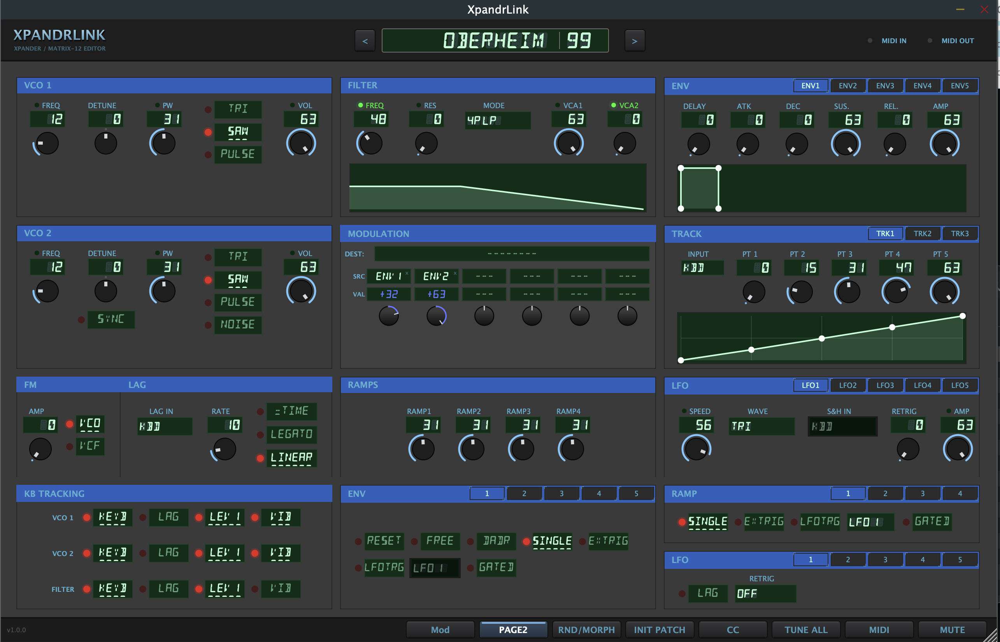

# XpandrLink

**A real-time editor, librarian, and DAW plugin for the Oberheim Xpander and Matrix-12.**

Standalone app, Audio Unit, and VST3 for macOS (Apple Silicon + Intel) and Windows.



## What it does

XpandrLink gives you hands-on visual control of every one of the 226 parameters in an
Xpander or Matrix-12 patch — five LFOs, five envelopes, three tracking generators, four
ramps, the 15-mode filter, and the full 20-slot modulation matrix — with everything kept
in sync bi-directionally: turn a knob on the synth and the editor follows; drag in the
editor and the synth updates instantly.

**Your patches are safe.** Every patch load, library audition, morph preview, and
randomizer roll is redirected to the hardware's slot 99 scratchpad. Memory slots 0–98
are never overwritten by browsing or editing.

### Highlights

- **Full editor** — all parameters live, with filter-response and draggable DADSR
  envelope visualizers, PAGE 2 advanced flags, and a hardware-faithful VFD interface
- **Mod matrix** — click-to-assign 20-slot routing with destination LEDs
- **Patch librarian** — import decades of stray `.syx` files and bank dumps, flag and
  remove duplicates automatically (content-hash), and audition patches with the arrow keys
- **Smart randomizer** — musical-safety guardrails keep every roll audible and playable
- **Tone morphing** — continuously interpolate between two patches, live on the synth
- **DAW automation** — record and draw automation lanes for any parameter; the plugin
  streams changes to the synth over its own direct MIDI connection, bypassing DAW SysEx
  filtering (yes, it works in Ableton Live); the current patch restores with your project
- **Zero-config MIDI** — the synth's input port and SysEx device ID are auto-detected; the
  output auto-selects too whenever it's unambiguous (a single MIDI interface, or one whose
  output shares the input's name) — otherwise pick it once in the MIDI pane

## Download

### 📦 [**Get the latest release →**](../../releases)

macOS universal (Standalone / AU / VST3) and Windows x64 (Standalone / VST3). Each release's
page has direct download links for both platforms plus first-launch instructions.

| Platform | Formats | Requirements |
|---|---|---|
| macOS 13+ | Standalone, AU (`aufx`), VST3 | Apple Silicon or Intel |
| Windows 10/11 x64 | Standalone, VST3 | — |

Install plugins to the usual locations (`/Library/Audio/Plug-Ins/Components` for AU,
`.../VST3` for VST3). Connect MIDI IN **and** OUT between your interface and the synth —
the editor auto-detects the port and device ID from the first SysEx it receives.

### First launch on macOS

These builds aren't code-signed with an Apple Developer ID, so Gatekeeper blocks them
on first launch — for the Standalone app *and* the AU/VST3 (plugins don't even get an
interactive prompt; your DAW just silently fails to load them, with no dialog to click
through). This is expected.

The download includes **`macsetup_XpandrLink.command`** — double-click it once, in the
same folder as the app/plugin, and it clears the block from everything at once, including
the AU/VST3 (there's no GUI-based fix for those — the script is it). The first time you
run the script itself, macOS will ask you to approve it (the same one-time Gatekeeper
prompt below, just for the script instead of the app) — after that, XpandrLink opens and
loads normally everywhere.

Double-click doesn't always work for `.command` files — depending on your macOS version,
Finder may open it in a text editor instead of running it, or refuse to run it at all. If
that happens: open **Terminal**, drag `macsetup_XpandrLink.command` from Finder into the
Terminal window (this fills in its full path), then press **Return**.

If you'd rather not run the script, you can still open the Standalone app manually:

1. Open XpandrLink.app as usual. macOS will refuse to launch it ("Apple could not verify
   this app is free of malware").
2. Open **System Settings → Privacy & Security**, then go to the **Security** section.
3. You'll see a note that XpandrLink was blocked, with an **Open Anyway** button — this
   button only appears for about an hour after step 1, so do this soon after; if it's
   gone, just try opening the app again to bring it back.
4. Click **Open Anyway**, then enter your login password to confirm.

After that, macOS remembers the exception and it opens normally from then on — this is
a one-time step per machine. The AU/VST3 have no equivalent manual path; run the script
for those, then rescan plugins in your DAW.

### First launch on Windows

Same situation, different mechanism: these builds aren't signed with a code-signing
certificate, so Windows marks the downloaded files and Microsoft Defender SmartScreen
blocks them the first time you try to run or load one.

The download includes **`winsetup_XpandrLink.bat`** — double-click it once, in the same
folder as `XpandrLink.exe`/`XpandrLink.vst3`, and it clears the block from both at once
(it runs `Unblock-File` on everything in that folder). Running the script itself will
trigger one SmartScreen prompt — click **More info**, then **Run anyway** — after that,
XpandrLink.exe runs and the VST3 loads in your DAW with no further prompts.

If you'd rather not run the script, the manual equivalent for the Standalone app:

1. Double-click XpandrLink.exe. You'll see **"Windows protected your PC."**
2. Click **More info**.
3. Click **Run anyway**.

For the VST3 (no run prompt like the app gets — a DAW just won't load it): right-click
`XpandrLink.vst3` → **Properties** → check **Unblock** at the bottom of the General tab
→ **OK**, then rescan plugins in your DAW.

Full instructions: **[User Guide](XpandrLink-User-Guide.md)**.

## Building from source

Requires CMake 3.22+, a C++17 toolchain, and [JUCE 8](https://github.com/juce-framework/JUCE)
checked out as a sibling directory (`../JUCE`).

```bash
# macOS
cmake -B build/mac -G Xcode -DCMAKE_OSX_ARCHITECTURES="arm64;x86_64"
cmake --build build/mac --config Release

# Windows
cmake -B build/win -G "Visual Studio 17 2022" -A x64
cmake --build build/win --config Release
```

Documentation for contributors: [SPEC.md](SPEC.md) (architecture, hardware protocol,
implementation invariants), [FEATURES.md](FEATURES.md), [DESIGN.md](DESIGN.md) (UI visual
spec), [ROADMAP.md](ROADMAP.md).

## Credits & lineage

- Built on the research and protocol implementation of
  **[XplorerEditor](https://github.com/xplorer2716/XplorerEditor)** —
  the original Windows/.NET editor whose curated Xpander/Matrix-12 SysEx documentation
  made this project possible. This project follows its author's recommendation to rebuild
  the editor on JUCE, ported to C++ and extended (librarian, randomizer, morphing, plugin
  formats, DAW automation).
- **[JUCE](https://juce.com)** framework (GPLv3 open-source license).
- **[DSEG](https://github.com/keshikan/DSEG)** 14-segment font by keshikan (SIL OFL 1.1) —
  the VFD display face.
- Oberheim is a trademark of its respective owner; this project is not affiliated with or
  endorsed by Oberheim.

## License

[GPL-3.0](LICENSE) — same as the upstream XplorerEditor.
